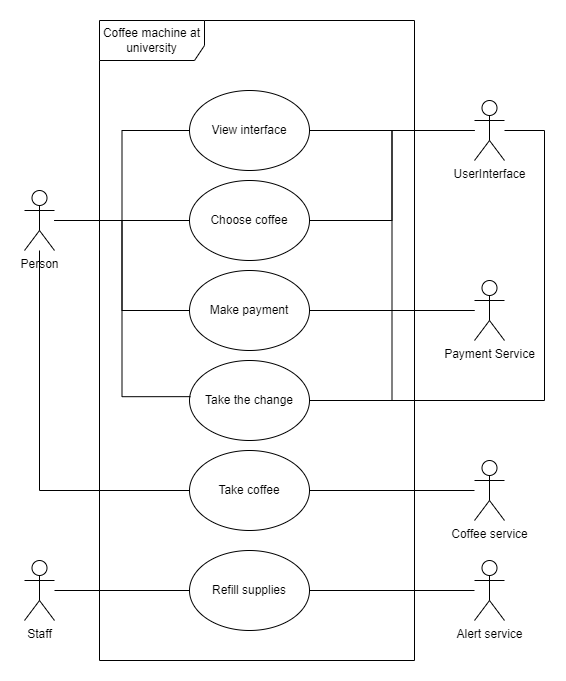
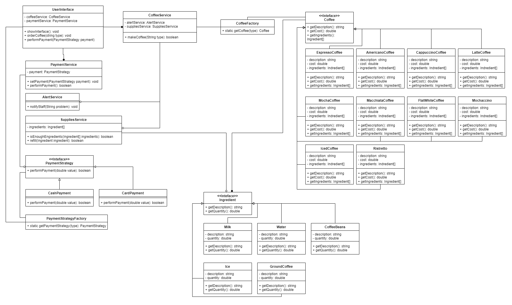

# Public Coffee Machine at a University

## Functional Requirements
- Accepts payments and provides change.
- Supports both cash and card payments.
- Offers at least 10 different types of coffee.
- Alerts staff when supplies need to be refilled.

## Non-Functional Requirements
- The coffee-making process must not exceed 1 minute.
- User-friendly interface is required.
- The machine must be energy-efficient.
- Drinks should be reasonably priced.

## Use Case Diagram

This use case diagram illustrates the interactions with the coffee machine system at a university. The main actors and their interactions are as follows:

### Actors
1. **Person (Students & Teachers):**
   - Views the interface.
   - Selects a coffee.
   - Makes a payment using various payment methods.
   - Receives change if necessary.
   - Collects the coffee after preparation.

2. **Staff:**
   - Refills supplies as monitored by the `AlertService`, which notifies staff when ingredients are low.

The system ensures that users can select and pay for coffee while staff handle machine maintenance and supply refills.

## Class Diagram

The class diagram models the structure of the coffee machine system, focusing on the coffee-making process, payment handling, and ingredient management. Key components include:

1. **UserInterface**: Manages user interactions for ordering coffee and processing payments.
2. **CoffeeService**: Oversees the coffee-making process, integrating with alert and supply services.
3. **PaymentService**: Handles payments using various strategies.
4. **AlertService**: Notifies staff of any machine issues.
5. **SuppliesService**: Monitors and refills ingredients as necessary.
6. **CoffeeFactory**: Creates coffee objects based on the specified type.
7. **Coffee Interface and Implementations**: Represents various coffee types (e.g., Espresso, Americano, Latte), each with descriptions, costs, and ingredient lists.
8. **Ingredients Interface and Implementations**: Models different ingredients (e.g., Milk, Water, Coffee Beans) with descriptions and quantities.
9. **PaymentStrategy**: An interface for handling payments, with concrete strategies for cash and card transactions.
10. **PaymentStrategyFactory**: Generates the appropriate payment strategy based on the specified type.

This design utilizes key design patterns (Factory, Strategy) to ensure flexibility and scalability in the system.
